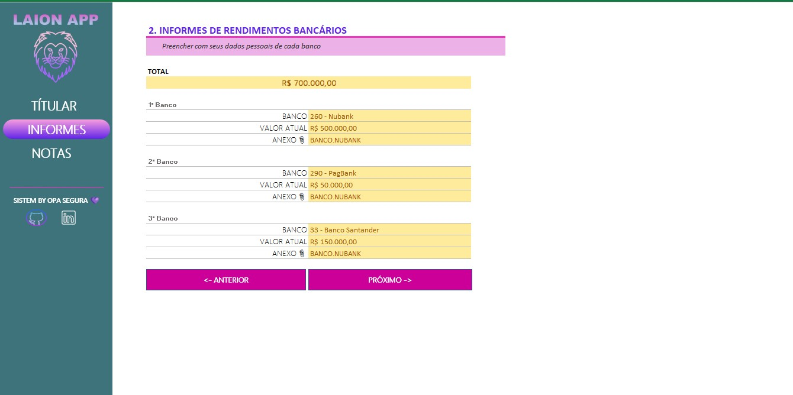
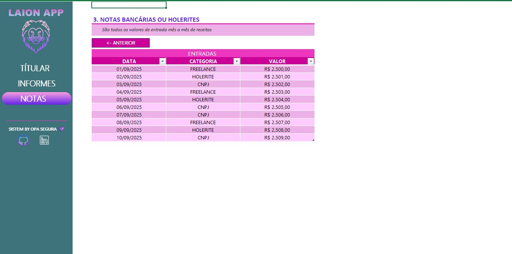

# Dominando tabelas com Excel.
## 1️⃣ Projeto:
Este laboratório tem como objetivo aplicar os conceitos de Excel no desenvolvimento de uma ferramenta prática de simulação de investimentos em fundos imobiliários. A partir de uma compreensão aprofundada sobre como os fundos imobiliários funcionam e as perguntas típicas dos investidores (quanto investir, por quanto tempo, taxa de rendimento, etc.), o desafio consiste em construir uma planilha que ajude o usuário a realizar essas simulações, auxiliando-o a tomar decisões mais informadas sobre seus investimentos. A solução proposta visa automatizar cálculos complexos, como o valor total investido, o patrimônio acumulado e os dividendos mensais, proporcionando ao usuário uma visão clara de seu potencial retorno📈📉📊.

## 👨🏾‍💻 Aprendizagem 👨🏾‍💻:
- Criar ferramentas de simulação de investimentos em Excel;
- Aplicar cálculos financeiros como rendimento mensal e cálculo de dividendos;
- Documentar processos técnicos de forma clara e estruturada; 
- Utilizar o GitHub como ferramenta para compartilhamento de documentação técnica.

# Trabalhando com Fórmulas no Excel.
## 2️⃣ Projeto:
Este projeto tem como objetivo criar uma ferramenta no Excel que ajude a organizar e reunir informações essenciais para a declaração de imposto de renda. A proposta é construir um agregador de dados no qual o usuário possa controlar suas entradas de maneira eficiente e validada, com menus de navegação, validações automáticas e funcionalidades extras, como links rápidos. A solução será completamente construída no Excel, com recursos que tornam a ferramenta robusta, mas com uma interface amigável e prática📈📉📊.

## 👨🏾‍💻 Aprendizagem 👨🏾‍💻:
- Aplicar os conceitos aprendidos em um ambiente prático;
- Documentar processos técnicos de forma clara e estruturada; 
- Utilizar o GitHub como ferramenta para compartilhamento de documentação técnica.  

<h2 id="Aluno">💻 Aluno</h2>

    
    
&nbsp&nbsp&nbspLuide Lima 
      
    &nbsp&nbsp&nbsp<a href="">Instagram</a>&nbsp;|&nbsp;<a href="https://github.com/LUIDELIMA">GitHub</a>&nbsp;|&nbsp;<a href="https://www.linkedin.com/in/luide-lima-83599680/">LinkedIn</a>&nbsp;

  

